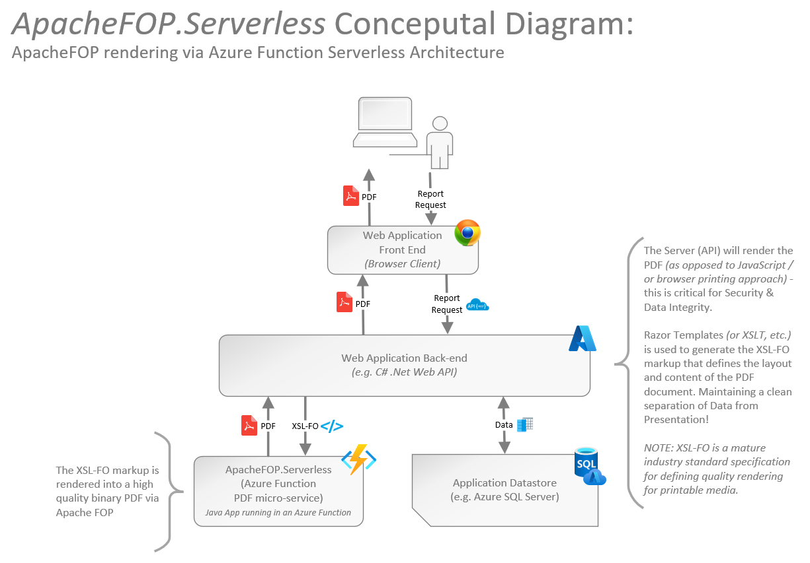
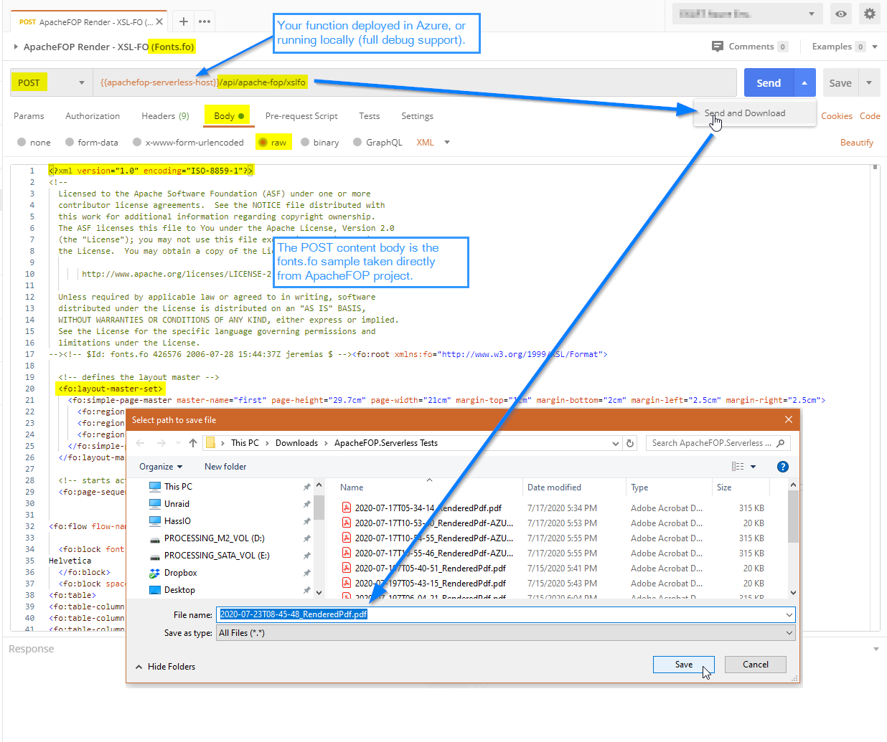
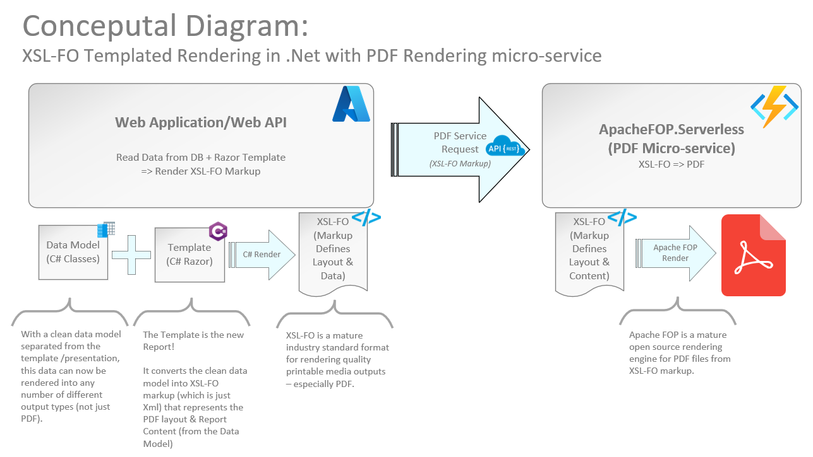

### Some background on Pdf Reporting in the .Net world...
For many-many years, I've implemented PDF Reporting solutions with [templating approaches](https://github.com/cajuncoding/PdfTemplating.XslFO) for various clients (enterprises & small businesses) 
to help them automate their paper processes with dynamic generation of _printable media_ outputs such as: PDF files, invoices, shipping/packaging labels, newletters, etc.

There have alwasy been a myriad of approaches to do this, but initially in the .Net world the primary way was to use some reporting tool such as Crystal Reports, or SQL Server Reporting Services, or even a third
party control... But all of these tools have some limitations making the job of generating high quality printable PDF outputs harder than it would seem. And all of them eventually fall into the 'technical debt'
hole as code that is no longer supported, not scalable, and/or just no longer sufficient for a variety of reasons; most of which is due to the tight coupling of data with the reports, limitations of the report 
designer tools (UI/Controls), or tech-stack supportability/burdens.  A key example of this is Crystal Reports whereby the COM interop element is still to-this-day plagued with memory (leak) issues, and it 
can't be used in modern .Net Core apps, etc.

In the end, I've found that markup based (delcarative) templating approaches really do alleviate many of these burdens . . . so for a more exhaustive dive into why PDF templating and markup based
 solutions are more powerful than report designer based solutions -- in today's modern web apps -- I ramble on about that over here in: 
 - [Part 1: Considerations for a robust PDF or Web reporting solution?](https://cajuncoding.com/2020-11-17-pdf-reports-part1-how-hard-can-it-be/)
 - [Part 2: Why markup based PDF Templating is the way to go...](https://cajuncoding.com/2020-11-18-pdf-reports-part2-ok-where-does-that-leave-us/)

Suffice it to say that markup based solutions have a lot of value, and Xsl-FO is still one of the best ways to maintain strong software development practices by rendering PDF outputs (as a presentation output) 
from separated content/data + template. And Xsl-FO offers features that some approaches just can't do (looking at you *Crystal Reports*).

Enter [ApacheFOP](https://xmlgraphics.apache.org/fop/)...a supported, open-source, full implementation of an XSL-FO processor in Java, that has continued to have regular updates/enhancements 
over the years. At one of my clients, the technology stack was fully Java based, so the use of _Apache FOP_ was a no-brainer. And, on this project we were able to retrieve our data, transform it via XSLT, 
and render great PDF outputs that were streamed to the client on demand -- it just worked!

But in the .Net world it hasn't been that easy.  For many years, there has been a .Net C# port (fully managed code) of [Apache FOP](https://xmlgraphics.apache.org/fop/) called **_FO.Net_**; based on a 
pre-v1.0 version (*is my guesstimate*). It's old & unsupported, but still fairly functional, and I've used it very successfully on several projects that were in use for 8-10+ years. 
But Apache FOP is now on [v2.6 as of Jan 2021](https://xmlgraphics.apache.org/fop/2.6/changes_2.6.html) with annual/bi-annual support updates still being released!

And, for a long while now I've known that the current _FO.Net_ implementation was limited by the fact that it was created circa 2008 and is now [an archived CodePlex project](https://archive.codeplex.com/?p=fonet).
But to be honest it has worked incredibly well, and reliably. As a fully managed C# solution, it ran in web projects as well a WinForms projects where users were able to view the rendered PDF live in the 
app, with real-time render updates (*constantly updating the render and loading into Acrobat PDF Reader embedded viewer*).  It provided an wonderful user experience for a several of my projects.

But, as things have evolved the advent of cloud services has opened doors for accomplishing this in a much more powerful/scale-able/manageable way -- particularly with **_Azure Functions_** and their excellent support 
for various technology languages including: .Net, Java, NodeJS, etc.!

So now on my newest projects I've been leveraging mini-services (dare I say micro-services) and serverless architectures, whereby PDF Reporting has, and will continue to be, a very critical requirement/capability. 
Now I've finally had the time to flush out the details of how to elegantly integrate the latest-and-greatest versions of ApacheFOP with .NET.... **the result of which I've shared in an open source project 
named [*ApacheFOP.Serverless*](https://github.com/cajuncoding/ApacheFOP.Serverless)!**

### The Architecture

Let's briefly touch on the overall architecture. The concept is simple if you're familiar with services oriented development.  With services you get abstraction and flexibility. Well in this case
we want to take advantage of this flexibiliy to abstract away the details of how the XSL-FO is rendered to a Binary PDF, and all our .Net application should be concerned with is how it can use a client
to send the XSL-FO markup and receive a valid PDF binary in return by calling an external service API -- in the case of **_ApacheFOP.Serverless_** it's a REST API (POST) request containing the Xsl-FO markup.

The PDF Rendering Service is able to facilitate this abstraction because Azure Functions allows us to run any Java application.  So all we need to do is expose ApacheFOP functionality via a REST endpoint,
and enrich the API by providing any additional functionality we want (e.g. support for Zip Compression requests/responses, Debugging capabilities, etc.)

Here's the Conceptual diagram to help clarify any questions:


##### Tangent -- Why Serverless with Azure Functions?
There are many reasons why servless architectures are great, and there are some cons too... but that's a whole other topic that I won't get into now.  But as a project structure, Azure Functions are very flexible
and can be deployed directly to Azure cloud in many different ways.  With the latest version of Azure Functions, not only can you deploy directly to an Azure Function Serverless app, but you can also
deploy the project as a containerized artifact, etc. So you have alot of control over the deployment style & infrastructure.  So, effectively Microsoft has empowered you to choose your own approach 
which lets you take advantage of, or mitigate, whatever pros/cons you wish.

##### Running Locally with Full Debugging capability
In addition, none of this precludes us from running the service locally.  It's really awesome to spin up *ApacheFOP.Serverless* locally and PostMan/Insomnia, or your live Web App also locally hit the service,
with live breakpoints inside *ApacheFOP.Serverless*!

#### The Result:
And Voila . . . we have a service that can be called to consistently render PDF Binary outputs, but is also highly scalable leveragin the Serverless architecture of Azure Functions.


#### Ok, how do I get this running for myself?
To get this up and running in your own Azure account, there are details on the [GitHub page here!](https://github.com/cajuncoding/ApacheFOP.Serverless#getting-started)

### Code Design for PDF Templating
As mentioned earlier, the key to rendering this PDF is now abstracted away into the PDF rendering service.  So now we are free to focus on our business requirements, and how
we want to render the XSL-FO markup (which is just well formed Xml).  There are many ways you can do this, but two of the most popular approaches are via XSLT or Razor Templating.

In the past, I used XSLT heavily, however this is much more of a niche skill that many developers don't grasp and generally dislike. Therefore, in my recent projects I've opted for Razor
templating approach which has garnered alot more favor by my teams -- and I've grown to really enjoy even more due to it's power & flexibility (e.g. partial templates & helper functions that
provide the full power of C# into any template).

Again, the concept is not rocket science if you've ever worked with any form of MVC, MvvM, or just decoupling of your Model from your presentation:

1. Retrieve your Data and build a well-formed model (C# class)...
   - This is when you may pre-process/pre-calculate lots of details that you do not want to have squirrelled away throughout your presentation logic!
2. Pass that model into your templating engine of choice to render well-formed Xsl-FO markup...
3. Now Send that markup to the PDF Service to render the PDF Binary...
4. Do whatever you like with your PDF binary :-)



#### Demo Project PdfTemplating.XslFO

I've also shared out a fully functioning demo project named [**_PdfTemplating.XslFO_**!](https://github.com/cajuncoding/PdfTemplating.XslFO)

This project encompasses more than I'm covering in this article, as it includes full demonstrations of creting the XslFO Markup via XSLT or Razor templates, as well as
rendering the binary PDF using both FO.Net and ApacheFOP.Serverless.

But one of the key elements I do want to highlight is that project provides several libraries that are **available on Nuget** to make everything easier and a bit less complex.

The relevant point for this article is that the project provides a complete demo of _ApacheFOP.Serverless_ in action! And, it also provides a ready-to-use .Net C# REST Client 
specifically for _ApacheFOP.Serverless_!

##### Rendering XSL-FO markup

I'm not going to go into much detail here, as this is just templating, but since I mentioned the Demo project above using, either XSLT or Razor, I figured I'd point out that the Nuget Packages are:
1. An XSLT helper library in Nuget: [PdfTemplating.XslFO.Xslt](https://www.nuget.org/packages/PdfTemplating.XslFO.Xslt/)
2. A Razor Templating Library (proxy library) for Asp.Net MVC Framework (not .Net Core): [PdfTemplating.XslFO.Razor.AspNetMvc](https://www.nuget.org/packages/PdfTemplating.XslFO.Razor.AspNetMvc/)
   - Eventually I plan to migrate some of my clients to .Net Core in which case I'll be sure to share out any useful approaches to using Razor Templating to generate markup.
   - *I'll likely post another blog article on how easy the library makes it to render Razor in-memory in an ASP.Net MVC app (.Net Core is not yet implemented but it's certainly feasible).*

##### Rendering the Pdf Binary via ApacheFOP.Serverless REST Client (.Net Standard)

And most importantly (for the focus of this article), here is a ready to use REST Client for **_ApacheFOP.Serverless_ in .Net** on Nuget: [PdfTemplating.XslFO.Render.ApacheFOP.Serverless](https://www.nuget.org/packages/PdfTemplating.XslFO.Render.ApacheFOP.Serverless/)

All the hard work of interacting with *ApacheFOP.Serverless*, and its advanced options for compression, debugging outputs from ApachFOP, etc. are all nicely encapsulated in the 
**_ApacheFOPServerlessPdfRenderService_** class -- a .Net Standard 2.0 library.

##### Code Snippet using the client available on Nuget:

I've talked about how easy this can be, but of course I'd be amiss if I didn't provide at least some code here in the article to back up my assertions.  So here is the abstraction/wrapper class that 
you'd add to your project to easily interact with the *ApacheFOP.Serverless* service. As you can see, the **Nuget** client makes it very straight-forward . . . and it just works!  

But even if you didn't want to take on the dependency, there's really not alot going on as it's fully REST based, so you could definitely create your own client 
using [RESTSharp](https://restsharp.dev/) or [Flurl](https://flurl.dev/) (*my new Favorite .Net REST Client & Url Builder*)!

&nbsp;  
###### Usage:

```csharp
  //Initialize configuration details for Azure Function (e.g. Web.config)
  //NOTE: The Azure Function Base/Host Url & Security Token should be provided; any all query-string params will be retained...
  //NOTE: The client already knows the correct API paths for Default configuration of ApacheFOP.Serverless...
  Uri azureFunctionHostUri = new Uri("https://apachefop-serverless.azurewebsites.net?code=XXXXXXXXXXXXXXXXXXXXXXXXXXXXXXXXXXXXXXXXXX");

  //Render your Markup however you like...
  XDocument xslFODoc = RenderXslFOMarkup(...);

  //NOw, with the above client you can access the Binary Pdf or other debugging details
  //  by executing the Transformation of the XSL-FO source to Binary Pdf via Apache FOP Service...
  var apacheFopServerlessClient = new ApacheFopServerlessClient(azureFunctionUri);
  var renderResponse = await apacheFopServerlessClient.RenderXslFOToPdfAsync(xslFODoc);

  //Process the results however you like...
  byte[] pdfBytes = renderResponse.PdfBytes;
  string eventLogDebugOutput = renderResponse.EventLogText;
```

&nbsp;  
###### ApacheFopServerlessClient (helper abstraction class):

```csharp
using System;
using System.Threading.Tasks;
using System.Xml.Linq;
using PdfTemplating.XslFO.ApacheFOP.Serverless;
using PdfTemplating.XslFO.Render.ApacheFOP.Serverless;

namespace MyApp.API.Reports.PdfRenderers
{
    public class ApacheFopServerlessClient
    {
        public Uri ApiUri { get; }

        //The input Uri should be configuration value read/injected that point to a valid instance of ApacheFOP.Serverless 
        //  running in Azure; and its' associated Azure Function Security Token.
        public ApacheFopServerlessClient(Uri apacheFOPServerlessApiUriWithToken)
        {
            ApiUri = apacheFOPServerlessApiUriWithToken 
                      ?? throw new ArgumentNullException(nameof(apacheFOPServerlessApiUriWithToken));
        }

        //NOTE: To ensure that the Xsl-FO Markup is well-formed we take in a valid XDocument!
        public async Task<ApacheFOPServerlessResponse> RenderXslFOToPdfAsync(XDocument xslFODoc)
        {
            //************************************************************************************************
            //Execute the Transformation of the XSL-FO source to Binary Pdf via ApacheFOP Serverless Rendering
            //************************************************************************************************
            var options = CreateOptions();
            var xslFOPdfRenderer = new ApacheFOPServerlessPdfRenderService(xslFODoc, options);

            var renderResponse = await xslFOPdfRenderer.RenderPdfAsync();
            return renderResponse;
        }

        protected virtual ApacheFOPServerlessXslFORenderOptions CreateOptions()
        {
            var options = new ApacheFOPServerlessXslFORenderOptions(ApiUri)
            {
                EnableGzipCompressionForRequests = true,
                EnableGzipCompressionForResponses = true
            };

            return options;
        }

    }
}
```

### Final Thoughts:
Some recent conversation on GitHub has helped me to realize that Visual Studio Code can run Java projects (Nice!!!), so I'll soon integrate a project setup into _ApacheFOP.Serverless_ for those that don't want
to have to rely on IntelliJ IDEA (*which is still the best Java IDE available*) as the Java IDE for running & publishing _ApacheFOP.Serverless_ locally.  

I truly hope that it helps many others out!

Now Geaux Code!
