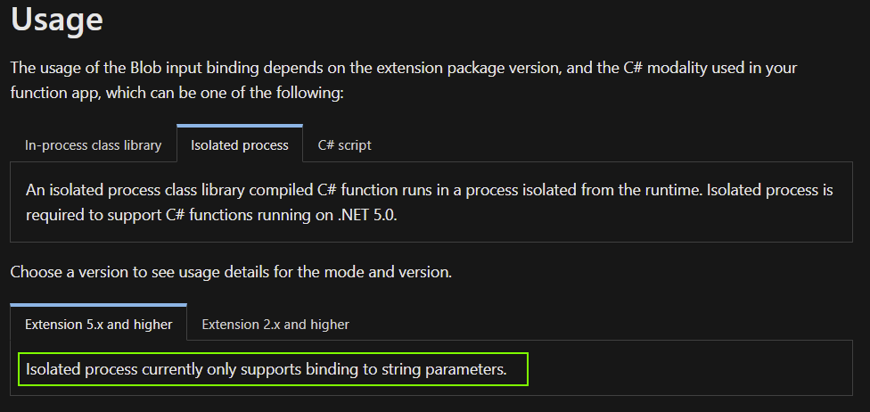
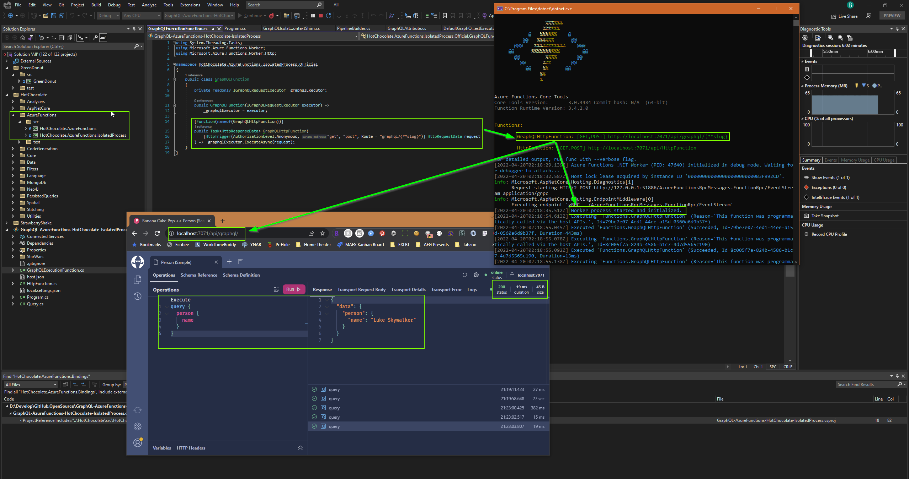

---
published: true
layout: post
title: If your interested in trying to get Custom Bindings working for Azure Functions Isolated Process -- Don't!
subtitle: Azure Functions Isolated Process bindings only support String data type.
cover-img: /assets/img/crawfish-banner.jpg
thumbnail-img: /assets/img/azure-fn-logo-raster.png
share-img: /assets/img/azure-fn-logo-raster.png
tags:
  - azure-functions
  - serverless
  - 'c#'
  - .net
  - under-the-hood
---
## Azure Functions Isolated Process support for HotChocolate GraphQL

#### The Rabbit Hole of Zero Docs
Recently I've been working with the core team over at [ChiliCream](https://chillicream.com/) to help contribute support for **Azure Functions** _Isolated Process_ model into 
the [HotChocolate GraphQL platform](https://chillicream.com/platform).

We collaborated for the initial Azure Functions in-process support, but the Isolated Process requires adapting the new `HttpRequestData` class that is injected, to an ASP.Net `HttpContext`
so that there are no other changes needed to HotChocolate... Luckily this isn't too difficult and was fully implemented in my _unofficial_ available library [GraphQL.AzureFunctionsProxy](https://github.com/cajuncoding/GraphQL.AzureFunctionsProxy).

The solution is relatively simple and elegant as we can gen up our own `HttpContext` via the `DefaultHttpContext` class that Microsoft Provides -- Thanks Microsoft!
I am thankful becuase most of the `Default` classes in the Azure Functions `Worker` libraries are all marked internal (uggg), but this one enables us to truly
unit test ASP.Net apps, and in this case build a really clean _adapter_ that I call the `HttpContextShim`.

And with the official integration of this into HotChocolate I've cleaned up and optimized the code a bit more and it is slated to be included in the 
**v12.9.0 release** and of course the upcoming **v13**.

Once released, this will officially deprecate my library for use only in older versions of HotChocolate GraphQL. Which I'm quite happy about, 
and the `AzureFunctionsProxy` worked great to enabled many of us to go live with our APIs well over a year & a half ago!

#### The Lesson Learned: Don't try Isolated Process Custom Bindings
Now more on main topic I wanted to share... I hate to admit it but I spent wayyyyyyy too much time trying to get the custom binding to work. Because the official support for In-Process Azure Functions
has a `[GraphQL]` custom binding that saves a couple lines of code -- there's no need for dependency injection or unnecessary references, allowing the GraphQL Request Exectuor to be injected directly into
the executing Function method.  It's really Elegant!  So of course, I thought, the Isolated Process should have partiy with this . . . 

That's when I started down the rabbit hole of ZERO documentation from Micrdosoft.  But there was one single helpful [blog by Maarten Balliauw](https://blog.maartenballiauw.be/post/2021/06/01/custom-bindings-with-azure-functions-dotnet-isolated-worker.html).
With Maarten's blog I was able to get the custom binding all wired and running, only to finally get runtime binding errors that my object could not be bound to `String` data type.

Uggg, another rabbit hole... I'll spare you the details, eventually I discovered there is an important detail [buried in the docs](https://docs.microsoft.com/en-us/azure/azure-functions/functions-bindings-storage-blob-input?tabs=isolated-process%2Cextensionv5&pivots=programming-language-csharp#usage) 
that clarifies _"Isolated process only supports binding string parameters"_ (likely due to complexities of marshalling data types between processes).... Doh! 🤕



So the realization that I'd burned an all nighter trying to get this working resulted in a significant under-the-hood learning: the Custom Bindings in the Isolated Process are overly complex, terrible developer experience, and 
useless for anything but string data-types, so save yourself a ton of frustration and just Don't 🤪

Not 30 minutes later I had the whole project fully up and running without a hitch once I relegated myself to just using DI -- minimized down to 2 concise lines of code.

###### Here's the entire Function to run GraphQL in the Isolated Process -- Nice!
```csharp
using System.Threading.Tasks;
using Microsoft.Azure.Functions.Worker;
using Microsoft.Azure.Functions.Worker.Http;

namespace HotChocolate.AzureFunctions.IsolatedProcess.Official;

public class GraphQLFunction
{
    private readonly IGraphQLRequestExecutor _graphqlExecutor;
    public GraphQLFunction(IGraphQLRequestExecutor executor) => _graphqlExecutor = executor;

    [Function(nameof(GraphQLHttpFunction))]
    public Task<HttpResponseData> GraphQLHttpFunction(
        [HttpTrigger(AuthorizationLevel.Anonymous, "get", "post", Route = "graphql/{**slug}")] HttpRequestData request
    ) => _graphqlExecutor.ExecuteAsync(request);
}
```

And voila, we have Azure Functions Isolated Process running GraphQL, working beautifully:



#### Final Thoughts:
Hopefully this saves someone else the time and frustration of knowing this limitation before I did.

Now Geaux Code!


